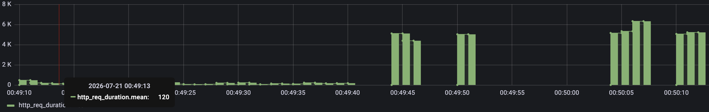
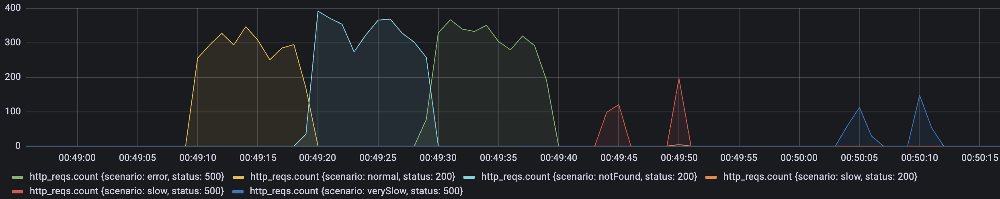
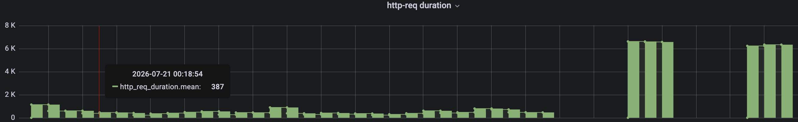
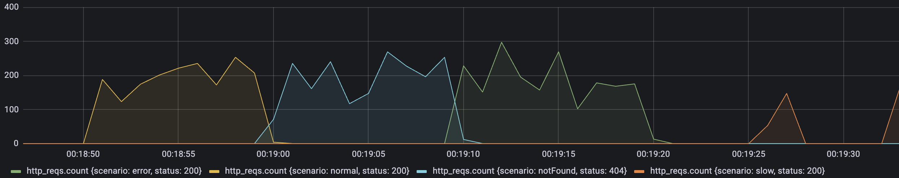
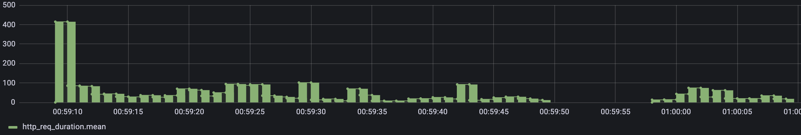
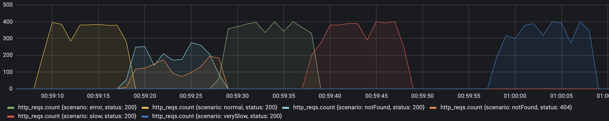

# Similar Products Backend

Spring Boot service that exposes an endpoint to retrieve similar products for a given product ID, delegating to an external products API.

## Requirements

- Java 21
- Maven
- Docker & Docker Compose (for containerized run)

## Running the application

### Locally

The application expects an external API running at `http://localhost:3001` by default (configurable via `application.yml`).

```bash
cd product-backend
./mvnw spring-boot:run
```

The server starts on port **5000**.

### With Docker Compose

```bash
docker-compose up --build
```

This builds the image and starts the service on port **5000**. The external API is expected at `http://host.docker.internal:3001`.

To override the external API URL:

```bash
SIMILAR_PRODUCTS_API_BASE_URL=http://your-api-host:3001 docker-compose up --build
```

## API

### GET /product/{productId}/similar

Returns a list of products similar to the given product.

**Response 200**
```json
[
  { "id": "2", "name": "Product B", "price": 29.99, "availability": true },
  { "id": "3", "name": "Product C", "price": 49.99, "availability": false }
]
```

**Response 404** — product not found
**Response 500** — unexpected error

### Swagger UI

Available at `http://localhost:5000/swagger-ui.html` when the app is running.

## Running the tests

### Unit tests

```bash
cd product-backend
./mvnw test
```

### E2E tests (Cucumber)

The E2E tests use WireMock to stub the external API — no real external service is needed.

```bash
cd product-backend
./mvnw verify
```

Cucumber feature file: `src/test/resources/features/similar_products.feature`

Scenarios covered:
- Successfully retrieve similar products for a valid product
- Return 404 when the product does not exist
- Return empty list when the product has no similar products

## Architecture

The project follows **Hexagonal Architecture** (Ports & Adapters):

```
domain/
  model/          # Product entity
  port/
    in/           # ProductUseCase (input port)
    out/          # ProductRepositoryPort (output port)
  service/        # ProductService (domain logic)
  exception/      # ProductNotFoundException

infrastructure/
  adapter/
    in/rest/      # ProductController, GlobalExceptionHandler
    out/api/      # SimilarProductsApiAdapter (calls external API via RestClient)
  config/         # BeanConfiguration (wires RestClient and ProductService)
```

Key design decisions:

- **RestClient** (Spring 6) is used instead of the deprecated `RestTemplate` for HTTP calls to the external API.
- **GlobalExceptionHandler** translates domain exceptions (`ProductNotFoundException`) to HTTP 404 responses with a structured error body.
- If fetching a specific similar product detail fails with a server error, that product is silently skipped so partial results are still returned.
- The external API base URL is externalised via the `similar.products.api.base-url` property, making it easy to override per environment.

## Resilience Patterns

The application protects itself from external API failures using [Resilience4j](https://resilience4j.readme.io). All four patterns are applied to `SimilarProductsApiAdapter` via Spring AOP annotations and configured in `application.yml`.

### Timeout

Handled at the HTTP-client level via `SimpleClientHttpRequestFactory`:

```yaml
similar:
  products:
    api:
      timeout-ms: 2000   # applied as both connect-timeout and read-timeout
```

Every individual HTTP call to the external API is capped at 2 seconds. If the external API takes longer, a `ResourceAccessException` is thrown and the circuit breaker fallback kicks in.

### Retry

```yaml
resilience4j:
  retry:
    instances:
      externalApi:
        max-attempts: 3          # 1 initial + 2 retries
        wait-duration: 200ms     # exponential backoff base
        retry-exceptions:
          - org.springframework.web.client.HttpServerErrorException
        ignore-exceptions:
          - com.julian.product_backend.domain.exception.ProductNotFoundException
          - org.springframework.web.client.HttpClientErrorException
```

On HTTP 5xx (transient server errors), the call is retried up to 3 times with a 200 ms wait between attempts. 4xx errors and `ProductNotFoundException` are never retried — they represent client or domain errors that a retry cannot fix.

### Circuit Breaker

```yaml
resilience4j:
  circuitbreaker:
    instances:
      externalApi:
        sliding-window-size: 10
        failure-rate-threshold: 50        # opens when ≥ 50 % of the last 10 calls fail
        slow-call-rate-threshold: 50      # opens when ≥ 50 % of the last 10 calls are slow
        slow-call-duration-threshold: 1s  # a call taking > 1 s counts as slow
        wait-duration-in-open-state: 10s  # stays open for 10 s before testing again
        permitted-number-of-calls-in-half-open-state: 3
        ignore-exceptions:
          - com.julian.product_backend.domain.exception.ProductNotFoundException
```

States:

| State | Behaviour |
|---|---|
| **CLOSED** | Normal. Both failures and slow calls (> 1 s) are counted in the sliding window. |
| **OPEN** | All calls are short-circuited immediately; the fallback returns an empty result. No HTTP requests are made. |
| **HALF-OPEN** | 3 probe calls are allowed; if they succeed the circuit closes, otherwise it opens again. |

`ProductNotFoundException` (HTTP 404) is excluded from the failure count — a missing product is not a sign of external API instability.

### Bulkhead

```yaml
resilience4j:
  bulkhead:
    instances:
      externalApi:
        max-concurrent-calls: 10
        max-wait-duration: 0ms   # reject immediately instead of queuing
```

At most 10 threads can be inside the adapter at the same time. Any thread that arrives when the limit is reached gets a `BulkheadFullException` instantly (no queue, no wait), which triggers the fallback and returns an empty result. This prevents thread-pool exhaustion under high concurrency.

### Fallback behaviour

| Situation | `fetchSimilarIds` | `fetchProductDetail` |
|---|---|---|
| Retry exhausted (all 5xx) | `[]` (empty list) | `Optional.empty()` |
| Circuit OPEN | `[]` | `Optional.empty()` |
| Bulkhead full | `[]` | `Optional.empty()` |
| HTTP 404 | `ProductNotFoundException` propagates | `ProductNotFoundException` propagates |
| Timeout | Circuit breaker intercepts → `[]` | Circuit breaker intercepts → `Optional.empty()` |

An empty result from `fetchSimilarIds` means no similar products are returned (HTTP 200 with `[]`). An empty `Optional` from `fetchProductDetail` means that individual product is silently skipped; the rest still appear in the response.

## Load Testing (k6)

A k6 load test was used to validate performance and behavior under concurrent traffic. The test script (from [dalogax/backendDevTest](https://github.com/dalogax/backendDevTest)) hits `GET /product/{productId}/similar` with multiple virtual users across five scenarios: `normal`, `notFound`, `error`, `slow`, and `verySlow`.

```bash
k6 run shared/k6/test.js
```

### HTTP client evolution

#### 1. RestTemplate

The initial implementation used `RestTemplate`. Under load, requests to product `6` (which does not exist in the external API) consistently returned **HTTP 505** errors — the external API was propagating an unexpected response that `RestTemplate` surfaced as a server error with no graceful handling.

---

#### 2. WebClient (reactive / async)

Switching to `WebClient` and converting the application to a reactive, non-blocking model eliminated the 505 issue but introduced a noticeable **increase in average response time**. The overhead of the reactive pipeline (scheduler context switching, Flux/Mono assembly) did not benefit a workload that is inherently sequential (fetch IDs → fetch each detail), and tuning complexity increased significantly.

**Request duration**


Mean: **120 ms**. Spikes still reach **5–6 K ms** on `slow`/`verySlow` — no timeout or circuit breaker to cap them.

**Request counts by scenario and status**


`error`, `slow`, and `verySlow` propagate as HTTP **500** — without a fallback, upstream failures surface directly to the client.

---

#### 3. RestClient (sync, no resilience)

Replacing `WebClient` with Spring 6's `RestClient` (synchronous, modern API) restored **good execution times** comparable to the original `RestTemplate` baseline, while providing cleaner error handling and no 505 propagation. This became the production choice.

**Request duration**


Mean: **387 ms**. Spikes reaching **6–7 K ms** as blocking threads pile up during `slow`/`verySlow` scenarios, exhausting the thread pool.

**Request counts by scenario and status**


`error`/`slow` return 200 (partial fallback). `notFound` correctly returns 404. No isolation — upstream slowness bleeds directly into all concurrent callers.

---

#### 4. Refined load test — better logging and error handling

A second round of load testing was run after improving structured logging and centralising error handling in `GlobalExceptionHandler`. The refined test confirmed that error scenarios (404, external 5xx, timeouts) were handled correctly and logged consistently without impacting the happy-path latency.

---

#### 5. Resilience4J + RestClient

A final comparison was made between the baseline (plain `RestClient`) and the version with all four Resilience4j patterns active (Retry, Circuit Breaker, Bulkhead, Timeout). The results showed **minimal performance degradation** under normal conditions — the overhead introduced by the AOP interceptors is negligible on the happy path, while the protection gained during failure scenarios significantly improves overall system stability.

**Request duration**


Latency scale drops to **500 ms max**. Peak spikes capped at ~**400 ms** — the 2-second timeout + open circuit prevents any call from blocking long.

**Request counts by scenario and status**


**All scenarios return 200** — retry + circuit breaker + bulkhead funnel failures into the fallback (empty list). `notFound` still correctly returns **404**.

---

### Summary

| Metric | WebClient (async) | RestClient (sync) | RestClient + Resilience4J |
|---|---|---|---|
| Mean latency | ~120 ms | ~387 ms | <100 ms (stable) |
| Max spikes | ~6 K ms | ~7 K ms | ~400 ms |
| Errors under failure | **500** | 200 (partial) | 200 (fallback) |
| Upstream isolation | None | None | Timeout + CB + Bulkhead + Retry |

## Tests

### Unit tests

```bash
cd product-backend
./mvnw test
```

Covers:

| Class | What is tested |
|---|---|
| `ProductControllerTest` | HTTP layer mapping, status codes |
| `ProductServiceTest` | Domain orchestration logic |
| `SimilarProductsApiAdapterTest` | Adapter in isolation (Mockito, no Spring context) |
| `SimilarProductsApiAdapterResilienceTest` | Resilience patterns with a real Spring context and WireMock |

#### Resilience test scenarios (`SimilarProductsApiAdapterResilienceTest`)

| Scenario | Pattern verified |
|---|---|
| Success after one transient 500 | Retry |
| All 3 attempts fail → empty result | Retry exhaustion + fallback |
| Empty `Optional` after 3 failed detail fetches | Retry exhaustion + fallback |
| Circuit opens after threshold → no further HTTP calls | Circuit Breaker OPEN state |
| HTTP 404 does not count as circuit failure | Circuit Breaker ignore-exceptions |
| Second concurrent call rejected → empty result | Bulkhead |

### E2E tests (Cucumber + WireMock)

```bash
cd product-backend
./mvnw verify
```

Feature file: `src/test/resources/features/similar_products.feature`

| Scenario | Expected |
|---|---|
| Valid product with similar products | 200 with product list |
| Product with no similar products | 200 with empty list |
| Product does not exist | 404 |
| External API responds with 5xx | 200 with empty list (retry + fallback) |
| External API times out | 200 with empty list (circuit breaker fallback) |
